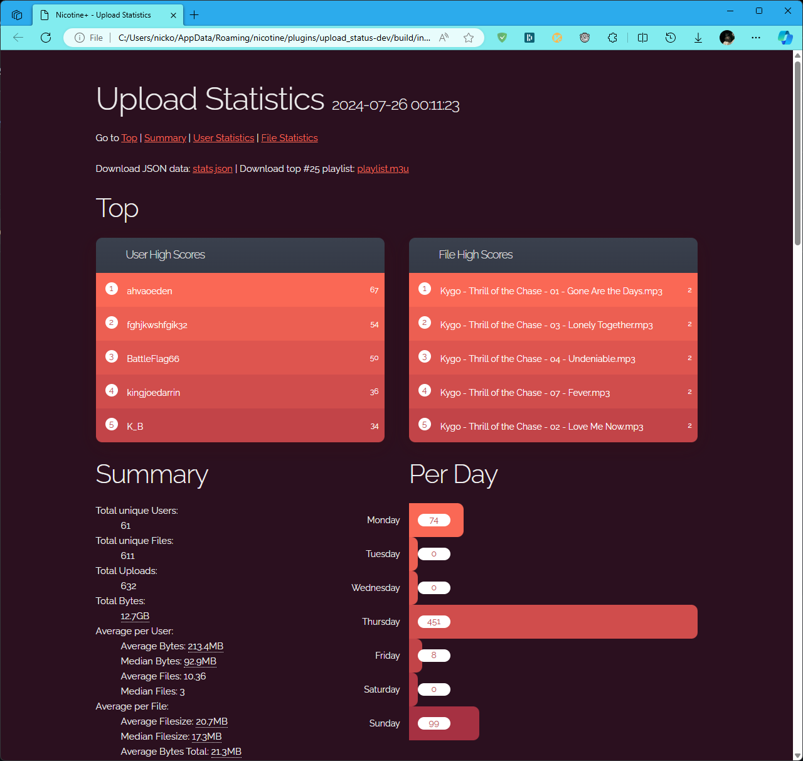

.. npc documentation master file, created by
   sphinx-quickstart on Wed Jul 24 23:08:44 2024.
   You can adapt this file completely to your liking, but it should at least
   contain the root `toctree` directive.

More Uplaods Stats Plugin
=========================

This is a plugin for collecting more upload statistics in Nicotine+.

By default Nicotine+ only shows the total amount of uploads and downloads.
This plugin will show you the amount of uploads and downloads per user,
the amount of uploads and downloads per file and the total number in bytes
and many more.

To make this as user friendly as possible the statistics can be displayed
in a convinient web interface using the ``/up-stats`` command.

Additionally to the webpage it also creates a playlist with the top most
downloaded files. This playlist can be opened with the ``/up-play`` command.

You can use ``/help`` or ``/up-help`` on N+ versions below 3.3.0 to get a
list of all available commands.

Commands
--------

Main commands
^^^^^^^^^^^^^

* ``/up-open``: Open the statistics page
* ``/up-stats``: Alias for ``/up-open``
* ``/up-play``: Open the top 25 uploads playlist file

Building commands
^^^^^^^^^^^^^^^^^

* ``/up-rebuild [user threshold] [file threshold]``: Rebuild the statistics page and playlist file, with optional custom thresholds
* ``/up-rebuild-page [user threshold] [file threshold]``: Rebuild the statistics page with optional custom thresholds
* ``/up-rebuild-playlist``: Rebuild the playlist file

Backup commands
^^^^^^^^^^^^^^^

* ``/up-backup``: Create a backup of the statistics
* ``/up-list-backups``: List all backups
* ``/up-restore [backup file]``: Restore the latest backup or a specific backup

Reset commands
^^^^^^^^^^^^^^

* ``/up-reset``: Start the reset process
* ``/up-reset-abort``: Cancel the reset process
* ``/up-reset-confirm``: Confirm the reset process

.. toctree::
    :hidden:
    :caption: Reference

    plugin
    defaults
    html
    utils

.. note::

   The ``/up-...`` prefix is used for all commands of this plugin to prevent
   collisions with other plugins.

.. note::

   This plugin is built with the ``npc`` (Nicotine+ Plugin Core) framework.
   It is a powerful core for building feature-rich Nicotine+ plugins with ease.

   .. seealso:: It's `documentation <https://naa.gg/npc>`_.

.. toctree::
    :hidden:
    :caption: Project

    changelog
    Github Repository <https://github.com/Nachtalb/more-upload-stats>
    NPC Documentation <https://naa.gg/npc>
    Me on Telegram <https://t.me/Nachtalb>
